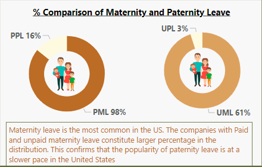

# Maven-Family-Leave-Challenge
### United States Parental Leave Policy

## Introduction
The United States does not have a federal law mandating paid parental leave for employees, although the Family and Medical Leave Act (FMLA) of 1993 requires employers with 50 or more employees to provide eligible workers with up to 12 weeks of unpaid leave per year for family and medical reasons, including the birth or adoption of a child.

Some states, however, have implemented their own paid parental leave policies but overall, the United States lags behind other developed countries in terms of parental leave policies. Many other countries offer paid parental leave for several months or more, allowing parents to bond with their newborns or adopted children and easing the financial burden of taking time off from work.

Therefore, this project analyzes the US parental leave policy using the dataset made available by **MAVEN ANALYTICS** for the Family Leave Challenge.

**The dataset contains:**
* A csv table with 1,601 records (one for each company)
* Company name and industry
* Paid and unpaid weeks off offered for parental leave

## Instruction
The instruction for the challenge is to create an impactful, one-page visual as a supporting content for an article.

## Problem Statement
1. What is the average parental leave length?
2. What is the general paternity leave statistics?
3. What is the general Maternity leave statistics?

## Data Cleaning 
The dataset was cleansed using Microsoft Excel. In the process, it was discovered that some companies have no corresponding industry. Instead of considering them as other, I decided to ask questions by conducting research and below are the findings:
* **Rokt**: is an **ecommerce technology** and it was categorized under **“Technology: Payment”**
* **Ink Communication**: is an **advertising agency** and was categorized as **“Advertising”**
* **ASML**: belong to a **semi-conductor sector** and this was categorized as **“Technology: Software”**
Data cleaning tools on excel such as TRIM, CLEAN etc. was used to ensure the data credibility.

## Things to Note

* Ordinarily, there is a clear difference between Zero (0) and “N/A” but putting it into context, it become expedient to consider the “N/A” as Zero. Simply put, the zero in this context is the same as not applicable.
* All companies were taken into consideration whether offering paid or unpaid maternity and paternity leave to account for the average parental leave. 
* In comparing the paid and unpaid parental leave, zero was excluded in getting the average paid and unpaid maternity and paternity but were filtered using the average parental leave which takes in to consideration all the companies in the dataset.
* For a fair result and representation, industries with 1-3 companies were excluded in the ranking.

## Skills/Concept demonstrated
* Bookmarking
* Data Cleaning
* DAX
* Modelling
* Filters
* Tooltips
* Shape
* Image

## Modelling

The model is a Flat schema. There are just two tables that are related. The relatable tables were joined with a many-to-many relationship.

## Visualization
The report comprises of a single page, visualizing the United States companies parental leave policy. You can interact with the report [here](https://app.powerbi.com/view?r=eyJrIjoiMjE2YjkxN2YtNDU0NC00MTRkLTkxMzctODhiM2JjOWU2ZTY0IiwidCI6IjM3NmQ3YjgwLTljNWEtNGMxNy05OWY1LTQ4MmJjYTY3MWQ4MCJ9&embedImagePlaceholder=true)

## Features
* Slicer (Dropdown) to display and filter by industry.
* Slicer (Dropdown) to display and filter by company
* Gauge to visualize the average, target and the minimum advisable leave length

## Analysis
### Company’s Headcount

|% Distribution       | Maternity Leave | Paternity Leave |
| :------------:      |:---------------:|:---------------:|
|  |    |    |

The dataset comprised of **1,601 companies across 185 industries**. Companies with parental leave amount to 1,573, out of which maternity represent 84% (1,573), paternity 15% (272) and N/A represent 1% (28).

## Adoption Rate of Maternity and Paternity leave

Maternity leave both paid and unpaid is the most common in the United States. It constitutes 98% and 61% paid and unpaid respectively. Meaning, most companies offer more of maternity leave. The paternity leave on the other hand constitutes 16% and 3% paid and unpaid respectively. Meaning that, paternity leave is still at incubation stage amidst the United States companies.

## Average Parental Leave

In calculating the average parental leave comprising of both the paid and unpaid maternity and paternity leave, all the companies were taken into consideration with the assumption that each company represent a sector whether they are offering the parental leave or not. The average parental leave however, amount to 19weeks which is below the minimum of 24weeks advised by UNICEF. 

| | |

The paid maternity leave has an average of 11weeks and 6weeks unpaid, while, the average paid paternity leave amount to 1week and less than 1week unpaid. This is to affirm the paternity leave statistics conducted recently and posted by Chris Kolmar on Zippia.com which states that “the average paternity leave length is approximately **one week** in the United States

## Paid & Unpaid Parental Leave Cycle

Considering the average parental leave, 89% of companies prefer leave below 12weeks, 10% prefer 12-24weeks and just a minute percentage prefer leave above 24weeks.

In the same vein, 89% of companies prefer leave below 12weeks, 10% prefer 12-24weeks and just 2% prefer leave above 24weeks.

## Paid & Unpaid Parental Leave Correlation

| | |

It is apparent that most companies with a considerable number of weeks off for maternity leave have little or no room for paternity leave. The paid and unpaid maternity and paternity leave are negatively correlated.

## Top 5 Industries
### Average Paid Parental Leave

The visual is two in one as the top 5 industries also have as a tooltips the top 3 companies that provide the best paid parental leave.

### Average Unpaid Parental Leave

These top 5 industries provide considerable length of unpaid parental leave. However, Government County is considered best in the provision of considerable parental leave as its topped in both paid and unpaid parental leave. 

## Insight

1. Paid and unpaid maternity leave is the most common amidst the United States industries/companies
2. Of the 1,601 companies, 98% offer paid maternity leave, 16% offer paid paternity leave, 61% offer unpaid maternity leave and 3% offer unpaid paternity leave. These is to further confirm that paternity leave is not in wide practice amidst the United States companies.
3. Paid and unpaid maternity and total paid and unpaid paternity leave are negatively correlated to each other and reveals that paternity leave growth is at a slower pace
4. On the average, approximately 89% of companies prefer leave below 12 weeks be it paid or unpaid, while 10% prefer 12-24 weeks
5. Government: County, Philanthropy, Business services are top industries with good parental leave provision

## Recommendation
#Recommendation: For robust analytics, it would be better to have a comparative analysis considering other countries parental leave policy with the effective ones in the United States

### Thank you 🥰

